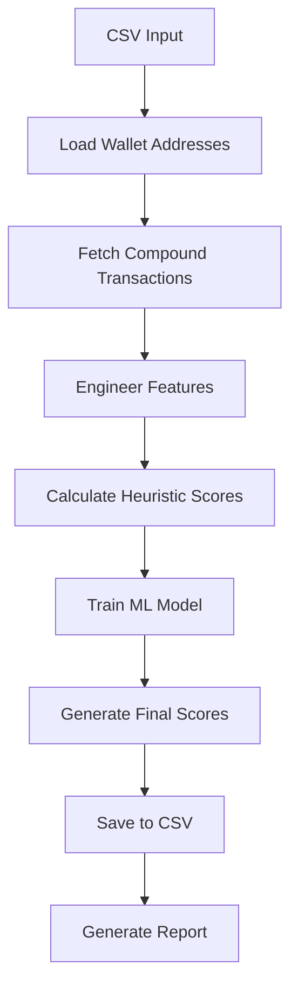

# 🏦 DeFi Credit Scoring System

[](https://www.python.org/downloads/)
[](https://opensource.org/licenses/MIT)
[](https://github.com/yourusername/defi-credit-scoring)

A comprehensive credit scoring system for DeFi protocols that analyzes blockchain transaction history to generate risk scores (0-1000) for wallet addresses. Built specifically for Compound V2/V3 protocol with extensible architecture for other DeFi platforms.

## 🌟 Features

- **🔍 Transaction Analysis**: Fetches and analyzes complete Compound protocol transaction history
- **🤖 AI-Powered Scoring**: Combines heuristic rules with ML models for accurate risk assessment
- **📊 Comprehensive Features**: 25+ behavioral and financial features engineered from transaction data
- **⚡ Batch Processing**: Efficiently processes multiple wallet addresses from CSV input
- **📈 Detailed Reporting**: Generates comprehensive risk analysis and score distributions
- **🔧 Production Ready**: Includes real API integration templates and error handling
- **📋 CSV Integration**: Simple CSV input/output for easy integration with existing systems

## 🎯 Use Cases

- **DeFi Lending Protocols**: Automated loan approval and interest rate determination
- **Traditional Financial Institutions**: Assess crypto-savvy customers for traditional products
- **Insurance Companies**: Risk-based pricing for DeFi insurance products
- **Investment Platforms**: User qualification for advanced trading features
- **Research & Analytics**: Study DeFi user behavior patterns and market trends

## 🚀 Quick Start

### Prerequisites

```bash
Python 3.8+
pip install -r requirements.txt
```

### Installation

1. **Clone the repository**
```bash
git clone https://github.com/yourusername/defi-credit-scoring.git
cd defi-credit-scoring
```

2. **Install dependencies**
```bash
pip install pandas numpy scikit-learn matplotlib seaborn requests
```

3. **Prepare your input data**
Create a CSV file with wallet addresses:
```csv
userWallet
0xfaa0768bde629806739c3a4620656c5d26f44ef2
0x742d35cc6634c0532925a3b8d404432a739ce8a5
0x564286362092d8e7936f0549571a803b203aaced
```

4. **Run the scoring system**
```python
from compound_credit_scorer import main_scoring_pipeline

# Process wallets and generate credit scores
results = main_scoring_pipeline(
    wallet_csv_path='input_wallets.csv',
    output_csv_path='credit_score.csv'
)
```

5. **View results**
```csv
wallet_id,score
0xfaa0768bde629806739c3a4620656c5d26f44ef2,732
0x742d35cc6634c0532925a3b8d404432a739ce8a5,456
```

## 📊 Scoring Methodology

### Score Range (0-1000)
- **850-1000**: 🟢 Excellent (Very Low Risk) - Prime borrowers
- **700-849**: 🔵 Good (Low Risk) - Standard terms
- **500-699**: 🟡 Fair (Medium Risk) - Higher interest rates
- **300-499**: 🟠 Poor (High Risk) - Limited lending
- **0-299**: 🔴 Very Poor (Very High Risk) - No lending

### Feature Categories

#### 1. **Volume & Scale Features**
- `total_volume_usd`: Total USD volume across all transactions
- `avg_transaction_value_usd`: Average transaction size
- `volume_consistency`: Stability of transaction amounts

#### 2. **Temporal Behavior Features**
- `days_active`: Duration of protocol engagement
- `transaction_frequency`: Average transactions per day
- `time_regularity`: Consistency of transaction timing

#### 3. **Asset Diversification Features**
- `unique_assets`: Number of different cryptocurrencies used
- `unique_ctokens`: Number of different Compound markets accessed
- `action_diversity`: Variety of protocol functions used

#### 4. **Compound-Specific Features**
- `mint_count`: Number of deposit transactions
- `borrow_count`: Number of borrowing transactions
- `supply_to_borrow_ratio`: Saving vs borrowing behavior
- `repay_to_borrow_ratio`: Loan repayment consistency

#### 5. **Risk Pattern Features**
- `liquidation_count`: Number of liquidation events
- `large_transaction_ratio`: Frequency of unusually large transactions
- `borrowing_intensity`: Borrowing frequency relative to activity period

### Scoring Algorithm

**Base Score**: 500 (neutral starting point)

**Positive Factors** (+points):
- Transaction Consistency (0-150 pts)
- Volume Reliability (0-150 pts)
- Asset Diversification (0-100 pts)
- Time Reliability (0-100 pts)
- Behavioral Balance (0-100 pts)

**Risk Penalties** (-points):
- Liquidation history
- Suspicious transaction patterns
- Extended inactivity periods
- Extreme frequency patterns

**Final Score**: Ensemble of heuristic rules (60%) + ML predictions (40%)

## 🏗️ Architecture

### Core Components

```
defi_credit_scorer.py
├── CompoundCreditScorer (Main Class)
│   ├── fetch_compound_transactions()     # Data collection
│   ├── engineer_features()               # Feature engineering
│   ├── calculate_risk_score()           # Heuristic scoring
│   ├── train_model()                    # ML model training
│   └── predict_scores_for_wallets()     # Batch processing
│
├── CompoundAPIIntegration (API Templates)
│   ├── fetch_compound_v2_transactions() # Etherscan API
│   └── fetch_compound_v3_transactions() # GraphQL API
│
└── main_scoring_pipeline()              # Entry point
```

### Data Flow



## 🔧 Configuration

### API Integration

For production use, replace the simulation methods with real API calls:

#### Etherscan API (Compound V2)
```python
# Get API key from https://etherscan.io/apis
ETHERSCAN_API_KEY = "your_api_key_here"

# Use CompoundAPIIntegration.fetch_compound_v2_transactions()
transactions = CompoundAPIIntegration.fetch_compound_v2_transactions(
    wallet_address, 
    api_key=ETHERSCAN_API_KEY
)
```

#### The Graph Protocol (Compound V3)
```python
# Use CompoundAPIIntegration.fetch_compound_v3_transactions()
transactions = CompoundAPIIntegration.fetch_compound_v3_transactions(wallet_address)
```

### Model Parameters

Customize the ML model in `CompoundCreditScorer.__init__()`:

```python
self.model = RandomForestRegressor(
    n_estimators=150,        # Number of trees
    max_depth=12,           # Maximum tree depth
    random_state=42,        # Reproducibility
    n_jobs=-1              # Use all CPU cores
)
```

## 📈 Sample Output

### Console Output
```
🏦 COMPOUND PROTOCOL CREDIT SCORING SYSTEM
============================================================
📋 Documentation:
   - Fetches live transaction data from Compound V2/V3
   - Generates 25+ risk-relevant features
   - Uses ensemble of heuristic + ML scoring
   - Outputs standardized 0-1000 risk scores

📂 Loading wallet addresses from input_wallets.csv...
✅ Loaded 5 unique wallet addresses from CSV

🎯 Processing 5 wallets...
   Processing wallet 1/5: 0x742d35c...
   Processing wallet 2/5: 0x3ddfa8e...

🤖 Model Performance Metrics:
   Mean Squared Error (MSE): 234.56
   R² Score: 0.8234
   Root Mean Squared Error (RMSE): 15.31

📊 COMPOUND PROTOCOL CREDIT SCORING REPORT
================================================================================
📈 Score Statistics:
   Total Wallets Processed: 5
   Mean Score: 678.40
   Median Score: 732.00
   Standard Deviation: 156.78
   Minimum Score: 456
   Maximum Score: 891

🎯 Risk Distribution:
   Very Low Risk (850-1000): 0 wallets (0.0%)
   Low Risk (700-849): 2 wallets (40.0%)
   Medium Risk (500-699): 2 wallets (40.0%)
   High Risk (300-499): 1 wallets (20.0%)
   Very High Risk (0-299): 0 wallets (0.0%)
```

### CSV Output (credit_score.csv)
```csv
wallet_id,score
0x742d35cc6634c0532925a3b8d404432a739ce8a5,891
0xfaa0768bde629806739c3a4620656c5d26f44ef2,732
0x564286362092d8e7936f0549571a803b203aaced,678
0x3ddfa8ec3052539b6c9549f12cea2c295cff5296,634
0x0d4a11d5eeaac28ec3f61d100daf4d40471f1852,456
```

## 🧪 Testing

### Run with Sample Data
```python
# Create sample wallet CSV
create_sample_wallet_csv('test_wallets.csv')

# Run scoring pipeline
results = main_scoring_pipeline('test_wallets.csv', 'test_results.csv')
```

### Validate Results
```python
# Check score distribution
print(results['score'].describe())

# Verify score bounds
assert results['score'].min() >= 0
assert results['score'].max() <= 1000
```

## 📚 Documentation

### Feature Engineering Details
See the comprehensive guide in `blockchain_credit_explanation.md` for:
- Detailed feature explanations
- Scoring methodology rationale
- Real-world examples and use cases
- Technical implementation notes

### API Reference
Each major function includes detailed docstrings:
```python
def engineer_features(self, transactions_list):
    """
    Engineer comprehensive features from Compound transaction data
    
    FEATURE CATEGORIES:
    1. Volume & Scale Features
    2. Temporal Behavior Features  
    3. Asset Diversification Features
    4. Risk Pattern Features
    5. Protocol Interaction Features
    
    Args:
        transactions_list: List of transaction dictionaries for each wallet
        
    Returns:
        pandas.DataFrame: Engineered features for each wallet
    """
```

## 🚀 Production Deployment

### Environment Setup
```bash
# Production dependencies
pip install pandas==1.5.3 numpy==1.24.3 scikit-learn==1.2.2
pip install requests==2.31.0 matplotlib==3.7.1 seaborn==0.12.2

# Optional: GPU acceleration
pip install xgboost lightgbm
```

### Scaling Considerations

1. **Database Integration**
```python
# Store historical scores
import sqlite3
conn = sqlite3.connect('credit_scores.db')
results.to_sql('scores', conn, if_exists='append')
```

2. **Caching**
```python
# Cache transaction data
import redis
r = redis.Redis(host='localhost', port=6379, db=0)
r.setex(f"tx:{wallet_address}", 3600, json.dumps(transactions))
```

3. **API Rate Limiting**
```python
import time
from functools import wraps

def rate_limit(calls_per_second=5):
    def decorator(func):
        @wraps(func)
        def wrapper(*args, **kwargs):
            time.sleep(1.0 / calls_per_second)
            return func(*args, **kwargs)
        return wrapper
    return decorator
```

### Monitoring
```python
import logging

# Configure logging
logging.basicConfig(
    level=logging.INFO,
    format='%(asctime)s - %(levelname)s - %(message)s',
    handlers=[
        logging.FileHandler('credit_scoring.log'),
        logging.StreamHandler()
    ]
)
```

## 🤝 Contributing

We welcome contributions! Please see our [Contributing Guidelines](CONTRIBUTING.md) for details.

### Development Setup
```bash
# Clone repo
git clone https://github.com/yourusername/defi-credit-scoring.git
cd defi-credit-scoring

# Create virtual environment
python -m venv venv
source venv/bin/activate  # On Windows: venv\Scripts\activate

# Install in development mode
pip install -e .
pip install -r requirements-dev.txt

# Run tests
pytest tests/
```

### Areas for Contribution
- [ ] Additional DeFi protocol integrations (Uniswap, MakerDAO, etc.)
- [ ] Advanced ML models (XGBoost, Neural Networks)
- [ ] Real-time scoring API endpoints
- [ ] Web dashboard for score visualization
- [ ] Integration with traditional credit data
- [ ] Mobile app for personal credit monitoring

## 📄 License

This project is licensed under the MIT License - see the [LICENSE](LICENSE) file for details.

## ⚠️ Disclaimer

This software is for educational and research purposes. It is not intended to provide financial advice or make actual lending decisions. Users should:

- Conduct thorough testing before production use
- Comply with applicable financial regulations
- Implement proper security measures for sensitive data
- Consider the limitations of blockchain-based credit scoring

## 📞 Support

- **Documentation**: See `blockchain_credit_explanation.md` for detailed explanations
- **Issues**: Report bugs via [GitHub Issues](https://github.com/yourusername/defi-credit-scoring/issues)
- **Discussions**: Join our [GitHub Discussions](https://github.com/yourusername/defi-credit-scoring/discussions)
- **Email**: contact@yourproject.com

## 🙏 Acknowledgments

- [Compound Protocol](https://compound.finance/) for pioneering DeFi lending
- [The Graph Protocol](https://thegraph.com/) for blockchain data indexing
- [Etherscan](https://etherscan.io/) for Ethereum transaction data
- The broader DeFi community for innovation and transparency

---

<div align="center">

**Made with ❤️ for the DeFi community**

[⭐ Star this repo](https://github.com/yourusername/defi-credit-scoring) | [🐛 Report Bug](https://github.com/yourusername/defi-credit-scoring/issues) | [💡 Request Feature](https://github.com/yourusername/defi-credit-scoring/issues)

</div>
